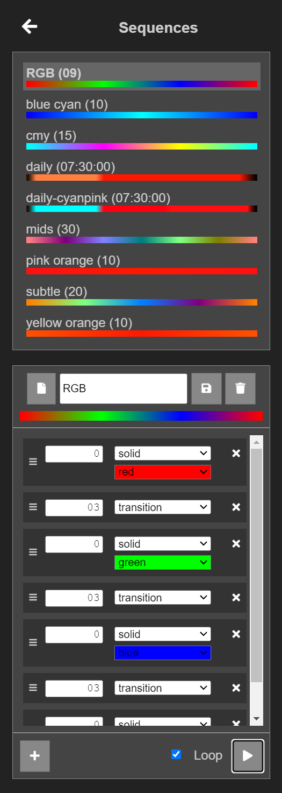

# RGB Strip controller for Raspberry Pi

This app allows you to control an RGB strip, connected to your Raspberry Pi through GPIO, from a web browser. On Chrome for Android, specifically, you can create a shortcut to the controller page on your home screen, and use it like any other RGB controller app.

This app was inspired by [this article](https://www.instructables.com/id/Easiest-RGB-LED-Strip-With-Raspberry-Pi/) on Instructables.

## How does it work?

This is a [`Flask`](https://flask.palletsprojects.com/en/2.1.x/) application, that uses either [`pigpio`](https://abyz.me.uk/rpi/pigpio/python.html) or [`lgpio`](https://abyz.me.uk/lg/py_lgpio.html), to set GPIO signals to control a connected RGB LED strip. An RGB amplifier is used to convert the 3.3V GPIO signals to 12V as required by a 5050 RGB strip.

Although this app has only been tested with a 12V strip, with an appropriate amplifier or circuit, this may even work with 5V strips.

## Setting it up

Here, we assume that you already have Raspberry Pi OS (or a compatible OS) installed on a Raspberry Pi (henceforth, RPi or Pi for short) and you have a working network connection on the RPi, ideally, with a static IP address. Additionally, you will need to know how to edit text files on your RPi and, either have a keyboard and display hooked up to your RPi while you set it up, or know how to connect to it over the network via SSH. All of this information is readily available online.

If you intend to run only this app on your RPi, the Lite image on a RPi Zero, should suffice.

The following instructions assume that the red, green and blue channels are being controlled by GPIO23, GPIO24 and GPIO25, respectively. If you're using different pins please see the [App Configuration](#app-configuration) section below.

### Hardware connections
 
The pin layout shown here is for a 1st generation RPi. Please check the pin layout for your version, before connecting.


### Software
Get to the command prompt on your RPi (direct login or SSH).

Install the prerequisites
```
sudo apt-get install python3 python3-flask git
```
Install _one_ of the following libraries:
- __`pigpio`__ (recommended but only works on kernel 5.10 or lower)
    - Raspbian / Raspberry Pi OS Legacy (Buster):
        ```
        sudo apt-get install pigpiod pigpio-tools python3-pigpio
        ```
    - Others: https://abyz.me.uk/rpi/pigpio/download.html
- __`lgpio`__ (flickering observed)
    - Ubuntu: https://ubuntu.com/tutorials/gpio-on-raspberry-pi#2-installing-gpio
    - Others (including Raspberry Pi OS): http://abyz.me.uk/lg/download.html

Determine the IP address of your RPi and note it down. For simplicity, we will refer to this IP address as `<Pi_IP_Address>`, where required.
```
hostname -I
```
Clone this repository
```
git clone https://github.com/singhaxn/rpi-rgb-app.git
```
Navigate into your app folder
```
cd rpi-rgb-app
```

Open `rgb-app.service` in your favorite editor and specify the correct `User` and `WorkingDirectory` in the `[Service]` section:
- `User` should be the owner of the `rpi-rgb-app` directory
- `WorkingDirectory` should be the absolute path to the `rpi-rgb-app` directory

Copy the service file into `/etc/systemd/system`
```
sudo cp rgb-app.service /etc/systemd/system/
```
Start the service
```
sudo systemctl daemon-reload
sudo service rgb-app start
```
Start the service automatically at boot
```
sudo systemctl enable rgb-app.service
```

## User Interface

In a web browser, on any device on your network (same network as the RPi), open the page `http://<Pi_IP_Address>:5000/`. On this page, click the power button. The LED strip should turn on white and you should see a page similar to this:


If not, see the [Troubleshooting](#troubleshooting) section below.

The gear icons can be used to edit colors and effects:




## App Configuration

The first time you run the app, the configuration file `config/settings.json` is created inside your clone of this repository. If you ever want to revert back to the default settings, simply delete `config/settings.json` and restart the `rgb-app` service. This section describes some common modifications that may be needed in this configuration file for your environment.

If you do need to edit the live configuration file, remember to stop the `rgb-app` service first:
```
sudo service rgb-app stop
```
and start it up again afterwards
```
sudo service rgb-app start
```

### Common Modifications
1. Specify the IP address of your Pi (`<Pi_IP_Address>`) under `bind-addr`. Ideally, this should be a static IP address. The default address is set to `127.0.0.1` which will be accessible only if your browser is running on the RPi itself.
2. If you want to use a different port, specify it under `bind-port`. For simplicity, the default port number `5000` is used in these instructions.
3. If you're using different pins than the default GPIO23, GPIO24 and GPIO25 for the red, green and blue channels, respectively, specify the correct GPIO IDs under `pins`. The sequence is `[R, G, B]`. Please note that these are GPIO ids and not physical pin numbers.

## Troubleshooting
1. ### `http://<Pi_IP_Address>:5000/` returns an `ERR_CONNECTION_REFUSED` error
    - Make sure, the correct bind address is specified in the configuration file, as described in the [App Configuration](#app-configuration) section above.

2. ### LED Colors are wrong
    - Do not expect the color reproduction of your RGB LED strips to be accurate with respect to the colors you see on your screen. Each LED strip is likely to have a different calibration. This is why only red, green, blue and white presets are provided by default. Still, double check to make sure the correct GPIO pin IDs are specified in the configuration file, as described in the [App Configuration](#app-configuration) section above.

3. ### `pigpio`-specific issues
    1. #### `pigs` works but you can't control your LED strip from the web interface
        - Make sure, the correct GPIO pin IDs are specified in the configuration file, as described in the [App Configuration](#app-configuration) section above.
        - Check whether __Schedule__ is enabled in the web interface. If so, then the LED strip will only turn on when specified in the schedule. Disable __Schedule__ if you want to control the lights manually.
        - Make sure __Brightness__ is not set too low on the web interface.
        - Make sure __Color__ is not set to `[0, 0, 0]` on the web interface.
    2. #### CPU usage is too high
        If you're using pigpio for the sole purpose of controlling an RGB strip, consider turning off alert sampling as follows:
        - Open `/lib/systemd/system/pigpiod.service` in your favorite editor and add the `-m` flag on the `ExecStart` line in the `[Service]` section:
            ```
            ExecStart=/usr/bin/pigpiod -l -s 10 -m
            ```
        - Restart the relevant services
            ```
            sudo service rgb-app stop
            sudo service pigpiod stop
            sudo systemctl daemon-reload
            sudo service pigpiod start
            sudo service rgb-app start
            ```